### Отчет о тестировании Гигапочты команды Гигачадов.

## Общие данные

- Место проведения тестирования: Google Chrome Версия 133.0.6943.143 (Официальная сборка), (64 бит)
- Продолжительность тестирования: 30 минут
- Домен giga-mail.ru - сейчас не работает.
## Определения

### 1. Страница регистрации  
Url - /signup  
  
**Корректная страница регистрации** - белое окно на сером фоне. В правой верхнем углу логотип почты (чб). Ниже слева надписи "Создание аккаунта", "Введите свои данные для регистрации". Правее 4 формы "Имя", "Почта" (в правой части формы готовый постфикс почты @gigamail.ru), "Пароль", "Подтвердите пароль". В правом нижнем углу кнопка "Зарегистрироваться" синего цвета.  
**Валидное имя** ≥ 5 символов Unicode, кроме русского алфавита  
**Валидный пароль** ≥ 6 символов Unicode, кроме русского алфавита  
**Валидная почта** ≥ 5 символов Unicode, кроме русского алфавита

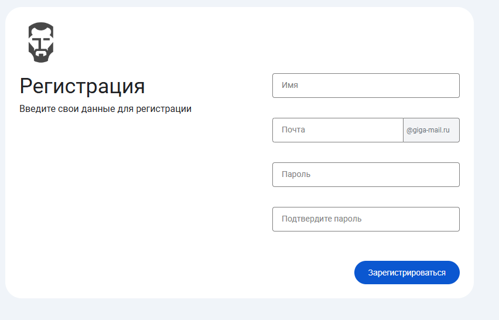

При вводе **невалидного имени** пользователя появляется ошибка "Имя должно быть не менее 5 символов"   
При вводе **_невалидной почты_** появляется ошибка "Почта должна быть не менее 5 символов"  

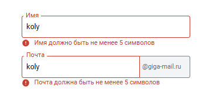  

При вводе **_невалидного пароля_** появляется ошибка "Пароль должен быть не менее 6 символов"  
При вводе в форме "Подтвердите пароль" несовпадающего пароля, появляется ошибка "Пароли не совпадают"  

При нажатии на кнопку "Зарегистрироваться" с одной из форм с пустым содержанием, под пустой формой появляется ошибка "Обязательное поле"  
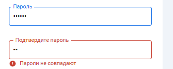

🔴Баг - При вводе символов и при последующем их удалении до пустого поля, ошибка формы "Пароль должен быть не менее 6 символов" не исчезает  

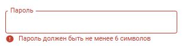

При вводе валидных данных во всех формах происходит переход на **_корректную страницу входящих писем_**

### 2. Страница входа (логина)  
  
Url - /login  

**Корректная страница логина** - белое окно на сером фоне. В правой верхнем углу логотип почты (чб). Слева ниже надписи "Войдите в аккаунт", "Используйте свой Giga Account". Справа две формы - "Почта" (в правой части формы готовый постфикс почты @gigamail.ru), "Пароль". В правом нижнем углу кнопка "Войти" синего цвета. В левом нижнем углу кнопка "Создать аккаунт" без заливки синего цвета. При наведении мыши на кнопку "Создать аккаунт" кнопка заливается серым цветом.  

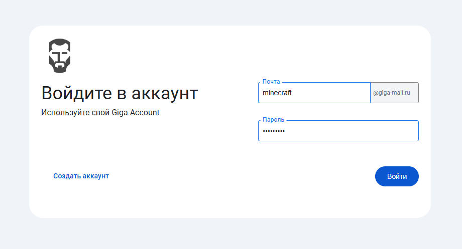  

При вводе **_невалидного пароля_** появляется ошибка "Пароль должен быть не менее 6 символов"   
При вводе **_невалидной почты_** появляется ошибка "Почта должна быть не менее 5 символов"  
При нажатии на кнопку "Войти" с одной из форм с пустым содержанием, под пустой формой появляется ошибка "Обязательное поле"  

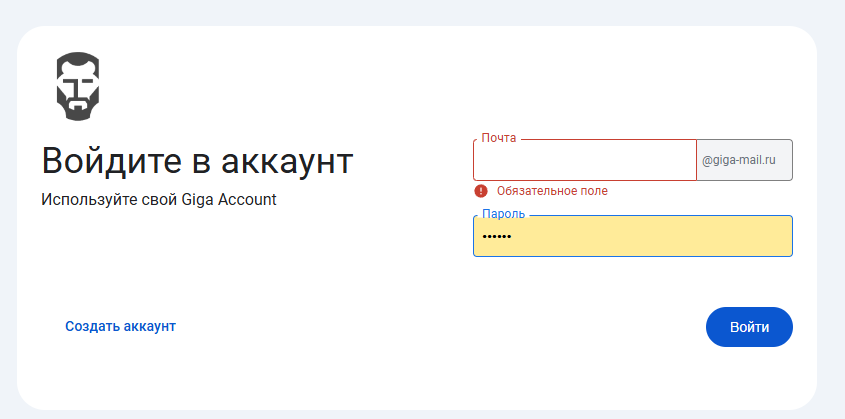  

При вводе существующего логина (уже используемого) и некорректного (не совпадающего с тем, что был указан при регистрации) пароля появляется ошибка "Неправильный логин или пароль" под формой пароля  
При вводе несуществующего логина и любого **_валидного пароля_** появляется ошибка "Неправильный логин или пароль" под формой пароля  

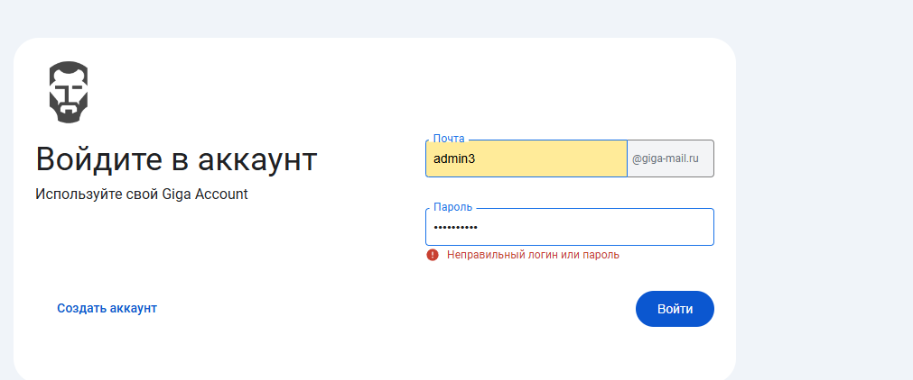  

При клике на кнопку "Войти" с **_валидной почтой_**, **_валидным паролем_**, которые были использованы при регистрации происходит вход - пользователь оказывается на **_корректной главной странице_**  

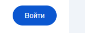  

При клике на кнопку "Создать аккаунт" происходит переход на **_корректную форму регистрации_**  

### 3 Главная страница
* **Корректно выглядящая верхняя панель навигации (шапка сайта)**:
  * В левом верхнем углу находится логотип почты
  * В правом верхнем углу находится круглое изображение аватарки, если оно установлено, если нет - изображение как на скриншоте
  * Слева от изображения аватарки находится кнопка в виде шестеренки
* **Корректно выглядящая левая панель навигации** (находится слева под шапкой, занимает примерно 1/5 ширины страницы):
  * Сверху (под логотипом) находится синяя кнопка - слева на ней черно-зеленый крест, а справа от него текст "Создать сообщение"
  * Под кнопкой "Создать сообщение" находится список папок - как минимум 5 кнопок для переключения на разные папки писем, каждая из которых содержит изображение, а справа от него текст:
      * Кнопка "Входящие"
      * Кнопка "Отправленные"
      * Кнопка "Спам"
      * Кнопка "Черновики"
      * Кнопка "Корзина"
  * Под списком папок находится синяя кнопка с текстом "Создать папку"
  * Если пользователь добавил собственные папки в интерфейс, они появляются выше кнопки "Создать папку" (в списке папок), под кнопкой "Корзина". Все добавленные папки имеют одно и то же изображение
  * Папка, открытая на странице в данный момент, выделяется синим цветом. По умолчанию на главной странице открывается папка "Входящие"

* **Корректно выглядящее центральное поле**:
  * Содержит список писем / содержание открытого письма / страницу редактирования письма / страницу настроек пользователя
url - /main

При успешном входе показывается **корректно выглядящая главная страница** почтового сервиса, содержащая список писем папки "Входящие".

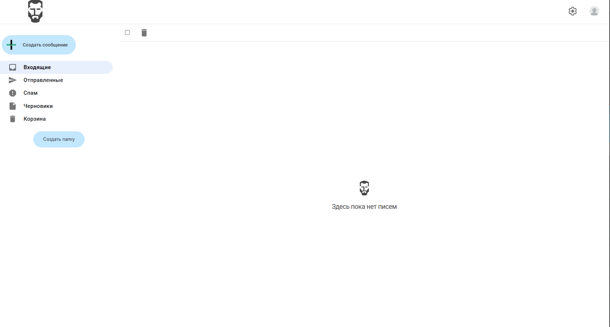

При нажатии на изображение аватарки в правом верхнем углу под ней появляется всплывающее окно с почтовым адресом пользователя (сверху) и синей кнопкой выхода из аккаунта "Выйти"

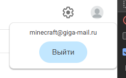

### 3 Страница профиля

Url - /settings  

**Корректный личный кабинет** - **_корректная страница входящих писем_** в центральном поле которой сверху вниз:
1) почта пользователя
2) аватар в круглой рамке черно-зеленого цвета. При отсутствии уникального аватара, загруженного пользователем, высвечивается дефолтная чб картинка. Справа снизу круглая кнопка загрузки нового аватара. При нажатии на нее, высвечивается окно файлового менеджера.
3) надпись "Здравствуй, ..." с именем пользователя.
4) кнопка "Сменить логин?", при нажатии на которую вместо кнопки появляется форма ввода почты(логина)
5) кнопка "Сменить пароль?" при нажатии на которую вместо кнопки появляется форма ввода нового пароля и форма повторения пароля

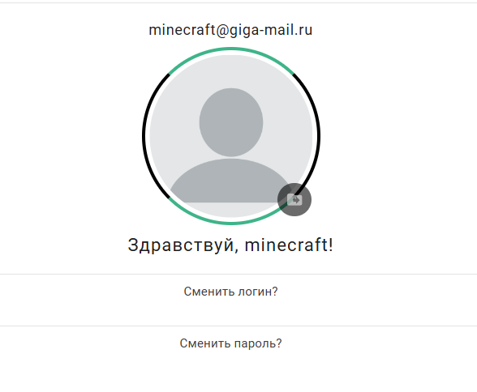

При вводе _невалидного пароля_ появляется ошибка "Пароль должен быть не менее 6 символов"   
При вводе _невалидной почты_ появляется ошибка "Почта должна быть не менее 5 символов" 
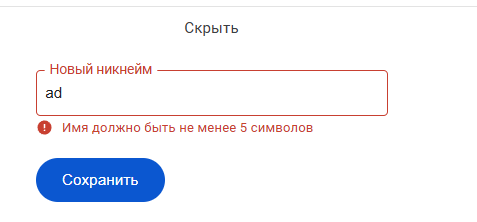

🔴Баг  - при смене логина не обновляется надпись "Здравствуй, ..." с именем пользователя.

🔴Баг -  из логина не возвращается имя пользователя, когда пользователь повторно входит в аккаунт. Вместо надписи "Здравствуй, ..." с именем пользователя надпись "Здравствуй, !"

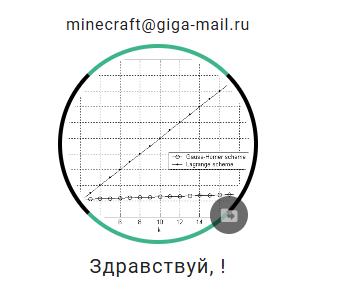

🔴Баг - при обновлении страницы пользователя перекидывает на главную страницу независимо от его расположения.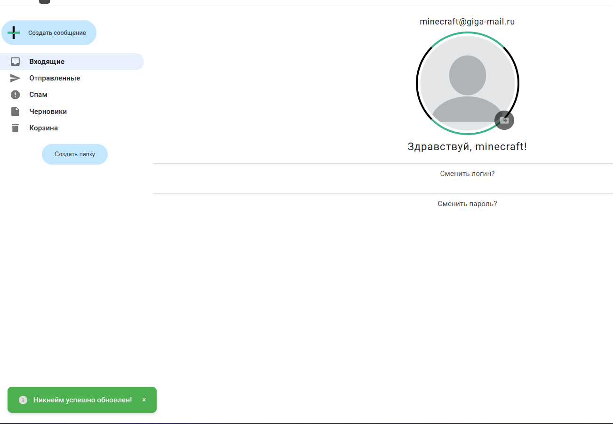

При вводе **_валидного пароля_** в форме смены пароля он успешно изменяется. Для проверки можно выйти из аккаунта, выбрав соответствующую кнопку в верхней панели и войти через окно логина с новым паролем.

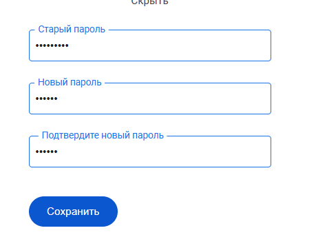

При загрузке изображения и нажатии кнопки "Сохранить" у пользователя успешно изменятеся аватарка.

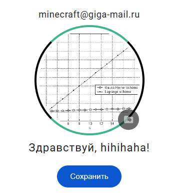

🔴Баг - аватарка изменяется только при обновлении страницы.

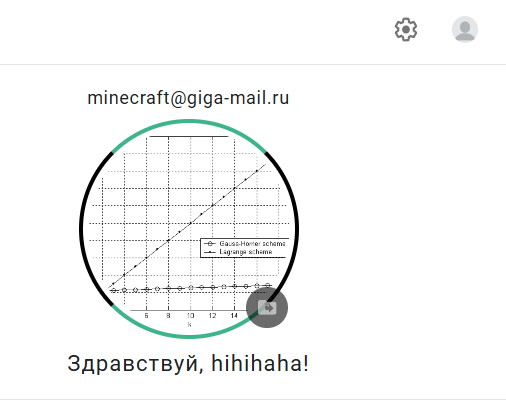
При обновлении страницы в поле аватара высвечивается аватарка пользователя

🔴Баг - При обновлении страницы пропадает аватарка при перерисовке. Изображение становится битым.

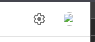

### 4 Левая панель навигации (каталог папок)

Url - /main?folder=название_папки

Слева на странице отображается **корректно выглядящая левая панель навигации**

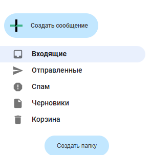

При нажатии кнопки "Создать папку" появляется всплывающее окно, содержащее:
* Поле ввода под названием "Введите название папки" - сверху
* Под ним (в левом нижнем углу) - синяя кнопка "Создать" 
* Крестик для закрытия окна в правом верхнем углу

При вводе названия папки (текст длины 1-30 символов Юникода) и нажатии кнопки "Создать" всплывающее окно закрывается и в левой панели навигации, в конце списка папок создается новый элемент с заданным названием (**корректное создание новой папки** описано ниже).

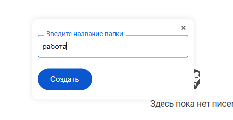

**Корректное создание новой папки**:
* **Корректное появление папки в списке папок**: Название папки (и изображение) появилось в списке папок в левой панели навигации
* **Корректное нажатие левой кнопки мыши**: При нажатии левой кнопки мыши кнопку с названием папки кнопка выделяется синим цветом (если не была выделена), все остальные кнопки папок перестают быть выделенными синим цветом, а в центральном поле открывается список писем этой папки
* **Корректное нажатие правой кнопки мыши**: При нажатии правой кнопки мыши кнопку с названием папки открывается контекстное меню, содержащее две кнопки - "Удалить папку" и "Переименовать папку"

**Корректное появление папки в списке папок**:

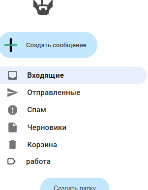

**Корректное нажатие левой кнопки мыши** (открылось содержание папки "Спам", сама кнопка выделилась синим цветом):

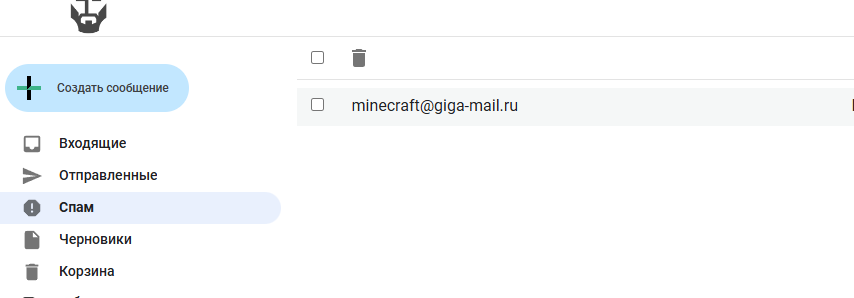

**Корректное нажатие правой кнопки мыши**:

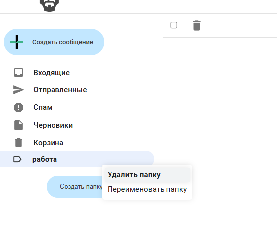

🔴Баг - можно удалить папку находясь в папке

🔴Баг - моргание страницы из-за долгой загрузки страницы ( полная перерисовка всех элементов DOM)

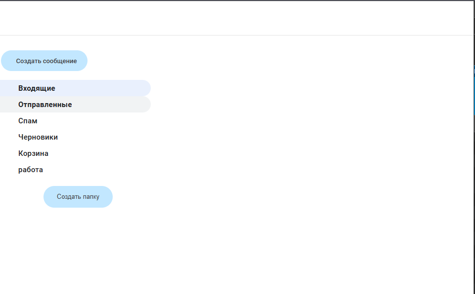

🔴Баг - можно создать папку при выходе из аккаунта

Url - /login

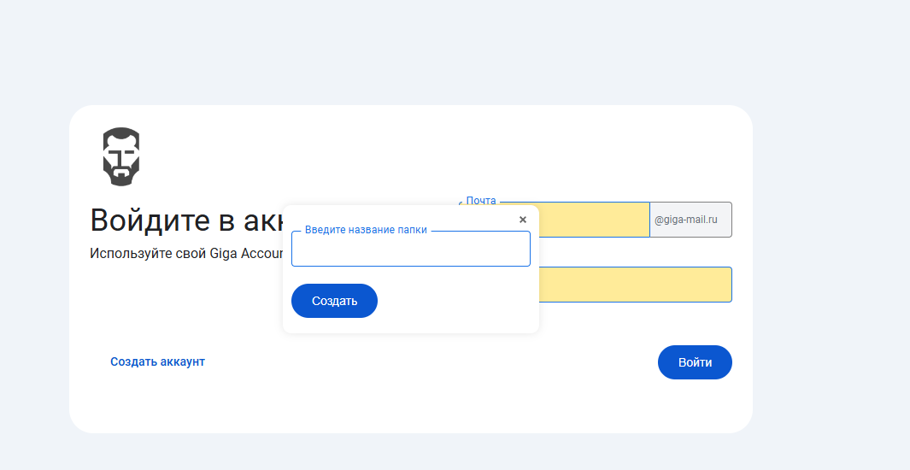

### 5 Письма
**Корректно выглядящий список писем**
* Список писем - занимает всю оставшуюся часть страницы, разделен на панель навигации и список писем
      * Сверху - панель навигации
        * В левом верхнем углу содержит "квадратик" - флажок для отметки всех писем на странице
        * Справа от него находится изображение корзины - кнопка для удаление всех отмеченных писем
      * Список писем
        * Если в списке нет писем, посередине пространства для списка писем появляется логотип и надпись "Здесь пока нет писем"
        * При наличии в папке писем они отображаются списком, каждое содержит почту отправителя, тему, текст и дату

Url - /create_email

При нажатии кнопки создать сообщение появляется окно, с формой:

* Кому
* Тема
* Описание
* Вложения
* Кнопки создание черновика и сообщения

При загрузке файла он корректно отображается во Вложениях

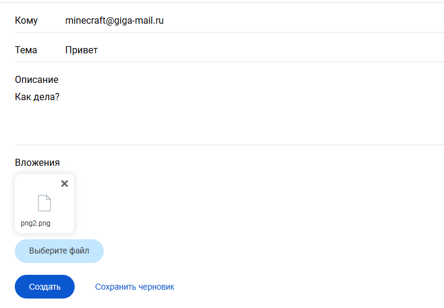

Корректное отображение отправленного сообщения

Url - /email/{id}

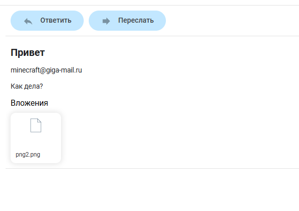

Корректное отображение в списке писем

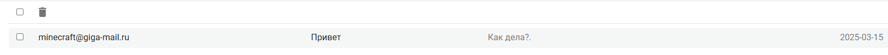

Пользователь может ответить на сообщение при помощи кнопки ответить

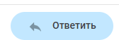

Открывается форма с авто-подстановкой значений из письма.

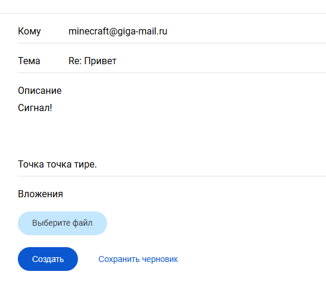

🔴Баг - Отступы в письме не сохраняются после отправки.

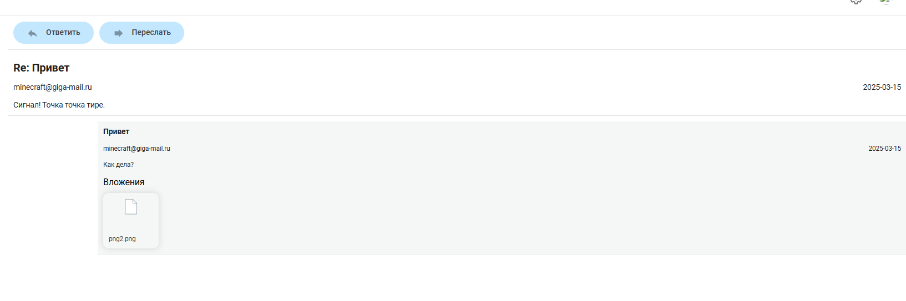

Пользователь может переслать  сообщение при помощи кнопки переслать

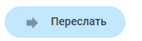

Открывается форма с авто-подстановкой темы письма.

Пользователь может скачать файл при нажатии на него во Вложениях.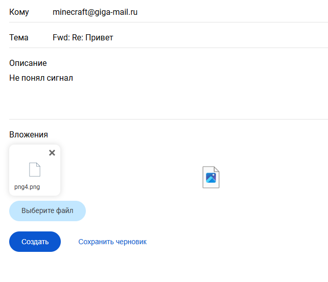

Корректное отображение истории переписки с учетом сообщений на которые ответили и переслали.

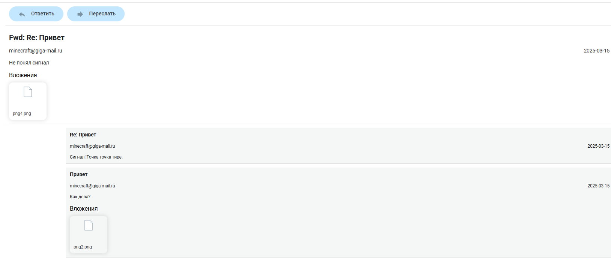

Корректное отображение прочитаных/непрочитанных сообщений

Url - /main?folder=название_папки

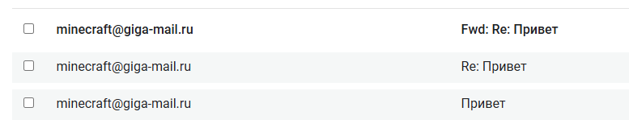

Корректное отображение выделения письма для удаления.

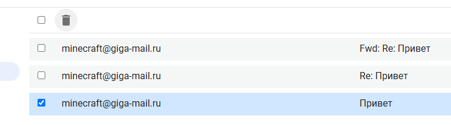

Выделение всех писем для удаления.

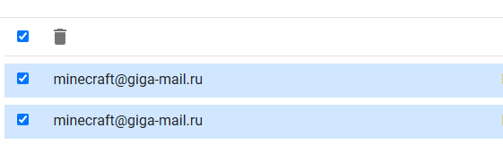

🔴Баг - При полном выделении и последующем снятии галочки с любого письма, галочка, которая отвечает за полное выделение не снимается.

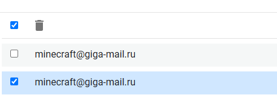
