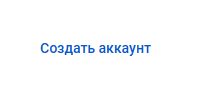
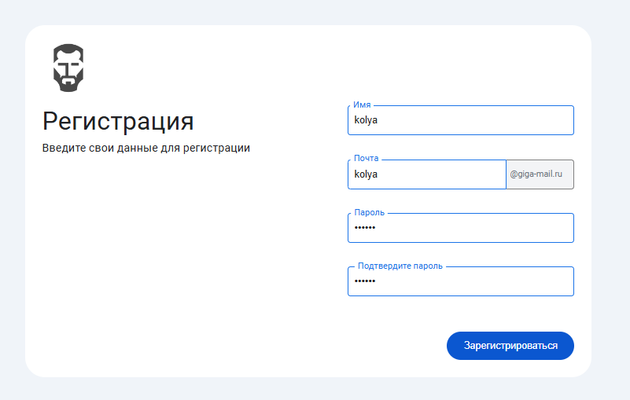
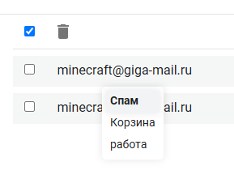
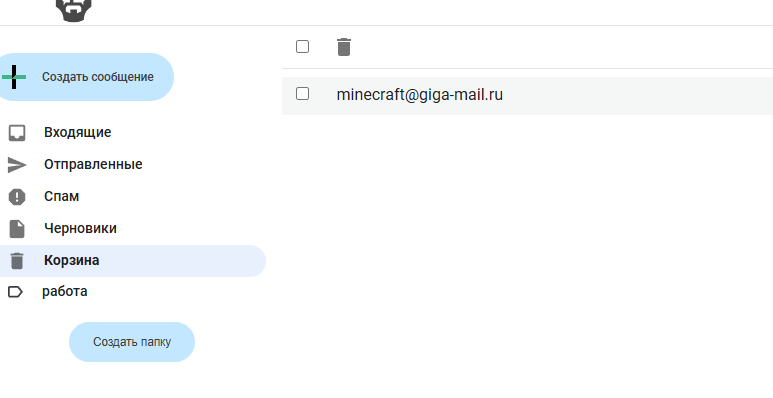

### Отчет о тестировании Гигапочты команды Гигачадов.

## Общие данные

- Место проведения тестирования: Google Chrome Версия 133.0.6943.143 (Официальная сборка), (64 бит)
- Продолжительность тестирования: 30 минут

### 1. Страница регистрации и авторизации

При клике на кнопку "Создать аккаунт" происходит переход на форму регистрации

**В окне содержится форма для создания аккаунта и кнопка перехода в форму авторизации**

При вводе невалидного имени пользователя или логина появляется ошибка

При вводе невалидного пароля появляется ошибка

🔴Баг - При вводе символов и при последующем их удалении до пустого поля, ошибка формы не исчезает

При вводе валидных данных происходит успешная регистрация

При вводе данных от существующего аккаунта происходит успешный вход в аккаунт и открывается главная страница приложения

При попытке входа без ввода логина и пароля появляется ошибка

При вводе существующего логина и некорректного пароля появляется ошибка

При клике на кнопку "Войти" происходит попытка входа

### 2 Главная страница

При успешном входе показывается главная страница почтового сервиса во вкладке "Входящие".

При нажатии на аватарку показывается всплывающее окно с кнопкой выхода из аккауна и почтовый адрес пользователя.

### 3 Страница профиля

При нажатии кнопки настроек показывается личный кабинет с функционналом смены аватара, логина и пароля.

Форма смены логина правильно валидируется и показывает ошибку при вводе менее 5 символов.

🔴Баг  - при смене логина не обновляется его контейнер на странице.

🔴Баг -  из логина не возвращается имя пользователя, когда пользователь повторно входит в аккаунт.

🔴Баг - при обновлении страницы пользователя перекидывает на главную страницу независимо от его расположения.

При правильных данных в форме смены пароля он успешно изменяется.

При загрузке изображения и нажатии кнопки "Сохранить" у пользователя успешно изменятеся аватарка.

**🔴**Баг - аватарка изменяется только при обновлении страницы.

🔴Баг - С некоторым шансом может пропасть аватарка при перерисовке

### 4 Каталог папок

Слева от списка писем отображается каталог папок и кнопки создания сообщения и папки

 

При нажатии кнопки Создать папку появляется окно, в котором при вводе названия создается папка.

Корректно отображение новой папки

🔴Баг - можно удалить папку находясь в папке

🔴Баг - маргание страницы из-за долгой загрузки страницы ( полная перерисовка всех элементов DOM)

При нажатии правой кнопки мыши по письму корректно отображается окно с действием по перемещению письма в другую папку.

Успешное перемещение письма в нужную папку.

Удаленное письмо отображается в папке корзина.

🔴Баг - можно создать папку при выходе из аккаунта

### 5 Письма

При нажатии кнопки создать сообщение появляется окно, с формой:

* Кому
* Тема
* Описание
* Вложения
* Кнопки создание черновика и сообщения

При загрузке файла он корректно отображается во Вложениях

Корректное отображение отправленного сообщения

Корректное отображение в списке писем

Пользователь может ответить на сообщение при помощи кнопки ответить

Открывается форма с авто-подстановкой значений из письма.

🔴Баг - Отступы в письме не сохраняются после отправки.

Пользователь может переслать  сообщение при помощи кнопки переслать

Открывается форма с авто-подстановкой темы письма.

Пользователь может скачать файл при нажатии на него во Вложениях.

Корректное отображение истории переписки с учетом сообщений на которые ответили и переслали.

Корректное отображение прочитаных/непрочитанных сообщений

Корректное отображение выделения письма для удаления.

Выделение всех писем для удаления.

🔴Баг - При полном выделении и последующем снятии галочки с любого письма, галочка, которая отвечает за полное выделение не снимается.

